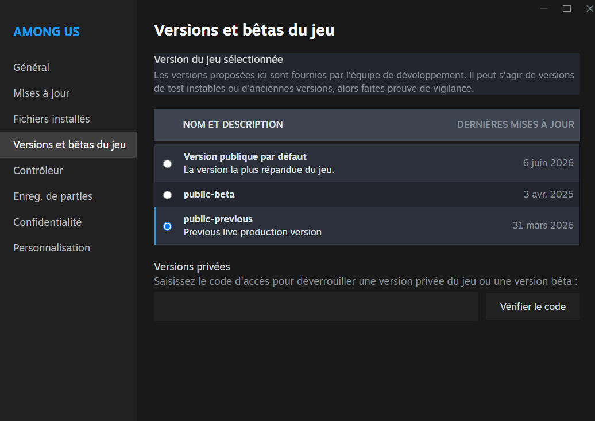

# TheOtherRoles-tuto

## tuto comment installer "TheOtherRoles" mod (Steam seulement)

1. Allez dans le proprietés de "among us" sur steam puis aller sur versions beta et choisir "public-previous"

2. Allez dans les fichiers locaux "among us" sur steam

3. Allez dans "common" puis copier le dossier "Among us"

4. Collez le dossier sous un autre nom

5. Telechargez "TheOtherRoles.zip" [ici](https://github.com/TheOtherRolesAU/TheOtherRoles/releases/tag/v4.8.0)

6. Extraire le dossier

7. Copiez les fichier compris dans "TheOtherRoles" et mettez les dans la copie du dossier "among us" que vous avez crée

8. Lancer la copie du jeu

NOTE : le jeu devrait prendre plus de temps a lancer
